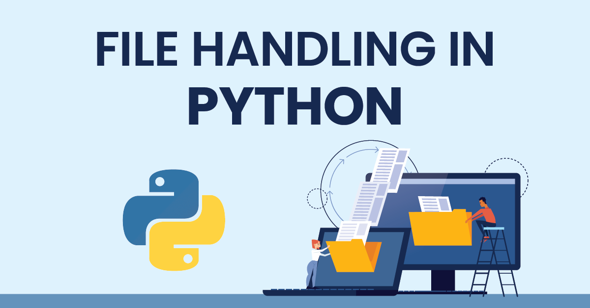

# 0x0B.Python-Input/Output

Before you start solving the task you have to make sure that you are familir with:
- Why Python programming is awesome
- How to open a file
- How to write text in a file
- How to read the full content of a file
- How to read a file line by line
- How to move the cursor in a file
- How to make sure a file is closed after using it
- What is and how to use the with statement
- What is `JSON`
- What is serialization
- What is deserialization
- How to convert a Python data structure to a `JSON` string
- How to convert a JSON string to a Python data structure

#### ***Here are some resources:***
- [7.2. Reading and Writing Files](https://docs.python.org/3/tutorial/inputoutput.html#reading-and-writing-files)
- [8.8. Predefined Clean-up Actions](https://docs.python.org/3/tutorial/errors.html#predefined-clean-up-actions)
- [Dive into python Chapter 11](https://histo.ucsf.edu/BMS270/diveintopython3-r802.pdf)
- [ JSON encoder and decoder](https://docs.python.org/3/library/json.html)
- [Python Read File and Python Write to File](https://techvidvan.com/tutorials/python-file-read-write/)

## Tasks

**0. Read file**
Write a function that reads a text file (`UTF8`) and prints it to stdout:

- Prototype: `def read_file(filename=""):`
- You must use the `with` statement
- You don’t need to manage `file permission` or `file doesn't exist` exceptions.
- You are not allowed to import any module

**1. Write to a file**
Write a function that writes a string to a text file (`UTF8`) and returns the number of characters written:

- Prototype: `def write_file(filename="", text=""):`
- You must use the `with` statement
- You don’t need to manage file permission exceptions.
- Your function should create the file if doesn’t exist.
- Your function should overwrite the content of the file if it already exists.
- You are not allowed to import any module

**2. Append to a file**
Write a function that appends a string at the end of a text file (UTF8) and returns the number of characters added:

- Prototype: `def append_write(filename="", text=""):`
- If the file doesn’t exist, it should be created
- You must use the `with` statement
- You don’t need to manage `file permission` or `file doesn't exist` exceptions.
- You are not allowed to import any module

**3. To JSON string**
Write a function that returns the JSON representation of an object (string):

- Prototype: `def to_json_string(my_obj):`
- You don’t need to manage exceptions if the object can’t be serialized.

**4. From JSON string to Object**
Write a function that returns an object (Python data structure) represented by a JSON string:

- Prototype: `def from_json_string(my_str):`
- You don’t need to manage exceptions if the JSON string doesn’t represent an object.

**5. Save Object to a file**
Write a function that writes an Object to a text file, using a JSON representation:

- Prototype: `def save_to_json_file(my_obj, filename):`
- You must use the `with` statement
- You don’t need to manage exceptions if the object can’t be serialized.
- You don’t need to manage file permission exceptions.

**6. Create object from a JSON file**
Write a function that creates an Object from a “JSON file”:

- Prototype: `def load_from_json_file(filename):`
- You must use the `with` statement
- You don’t need to manage exceptions if the JSON string doesn’t represent an object.
- You don’t need to manage file permissions / exceptions.

**7. Load, add, save**
Write a script that adds all arguments to a Python list, and then save them to a file:

- You must use your function `save_to_json_file` from `5-save_to_json_file.py`
- You must use your function `load_from_json_file` from `6-load_from_json_file.py`
- The list must be saved as a JSON representation in a file named `add_item.json`
- If the file doesn’t exist, it should be created
- You don’t need to manage file permissions / exceptions.

**8. Class to JSON**
Write a function that returns the dictionary description with simple data structure (list, dictionary, string, integer and boolean) for JSON serialization of an object:

- Prototype: `def class_to_json(obj):`
- `obj` is an instance of a Class
- All attributes of the `obj` Class are serializable: list, dictionary, string, integer and boolean
- You are not allowed to import any module

**9. Student to JSON**
Write a class `Student` that defines a student by:

- Public instance attributes:
    -   `first_name`
    -   `last_name`
    -   `age`
- Instantiation with `first_name`, `last_name` and `age`: d`ef __init__(self, first_name, last_name, age)`:
- Public method def `to_json(self)`: that retrieves a dictionary representation of a `Student` instance (same as `8-class_to_json.py`)
- You are not allowed to import any module

